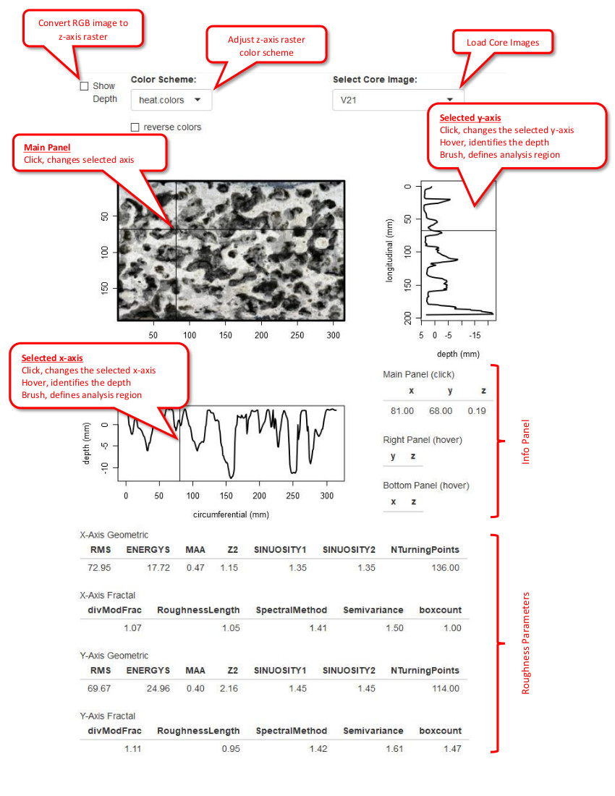

# R-Roughness
R-Roughness calculates geometric and fractal roughness parameters along user-defined cross-sections.  The user selects a rasterized (RGB+z) point cloud from a photogrammetic model of several limestone cores.  Axes are identfied and may be refined to a subset of the entire cross-section, then roughness parameters are tabulated.  To assist a conceptual understanding of roughness, the core image can be displayed as a raster image of depth (shown as deviation from the mean) and as a profile along the selected axes.

The default selected axis is the mid-point of the cross-section.  If a subset is not defined by brush selection within the side panels, then the roughness parameters are calculated for the entire cross-section.

Algorithms for the Geometric and Fractal Roughness parameters we written by Stephanie Brown at the Univ of North Florida and ported to R using the pracma package.